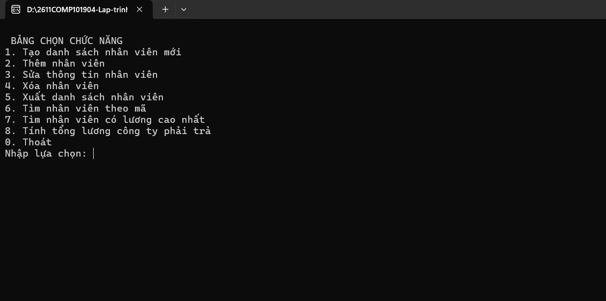
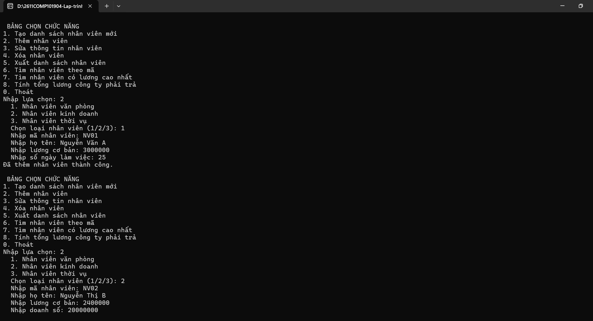
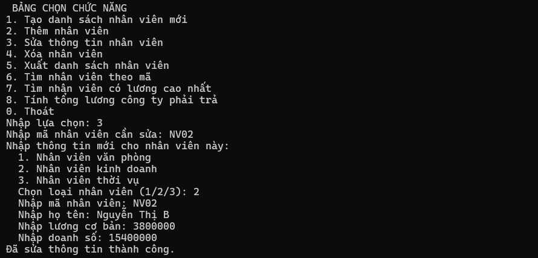
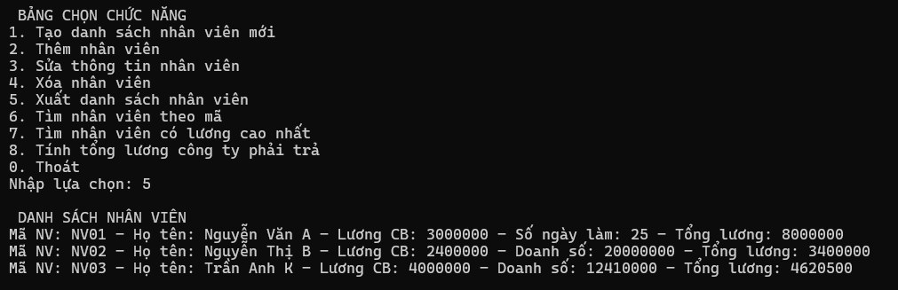
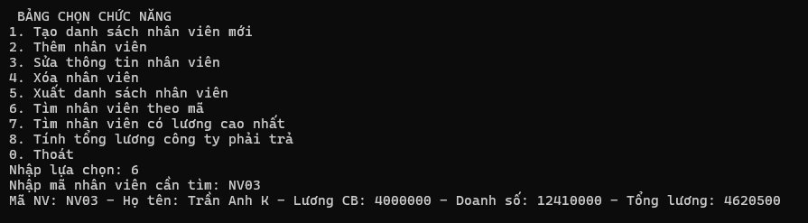
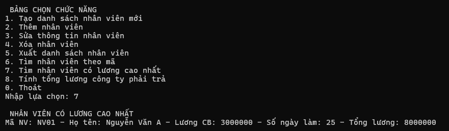
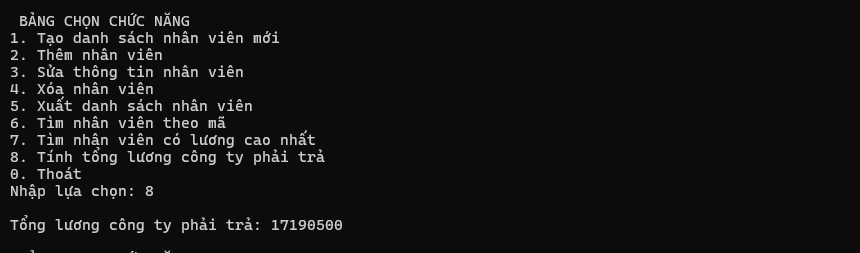
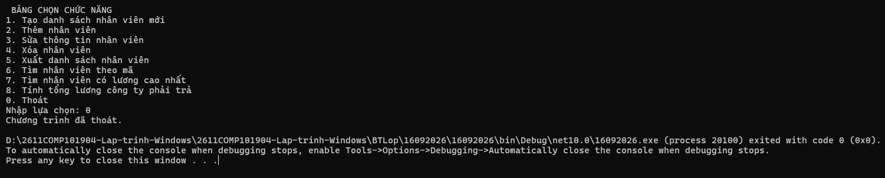

# Bài tập trên lớp- 16092026- Quản lý nhân viên

## Thông tin sinh viên
* **Họ tên:** Trần Phước Thái
* **MSSV:** 51.01.104.091
* **Lớp:** 51.01.CNTT.B

## Mô tả
Chương trình Console Application viết bằng ngôn ngữ C# phục vụ việc quản lý danh sách nhân viên công ty. Dự án được thiết kế theo các nguyên lý của OOP.

## Chức năng
1. Tạo danh sách nhân viên mới
2. Thêm nhân viên
3. Sửa thông tin nhân viên
4. Xóa nhân viên
5. Xuất danh sách nhân viên
6. Tìm nhân viên theo mã
7. Tìm nhân viên có lương cao nhất
8. Tính tổng lương công ty phải trả
0. Thoát
## Hình ảnh minh họa

### 1. Giao diện chương trình

### 2. Nhập thông tin thành công

### 3. Sửa thông tin nhân viên

### 4. Xuất danh sách nhân viên

### 5. Tìm nhân viên theo mã 

### 6. Tìm nhân viên có lương cao nhất

### 7. Tính tổng lương công ty phải trả

### 8. Thoát chương trình
