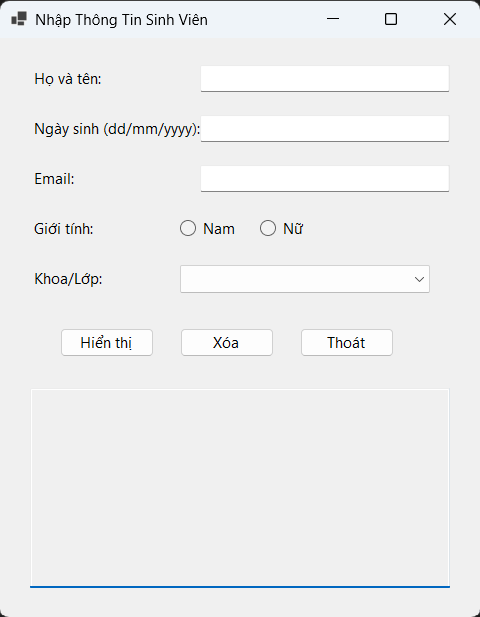
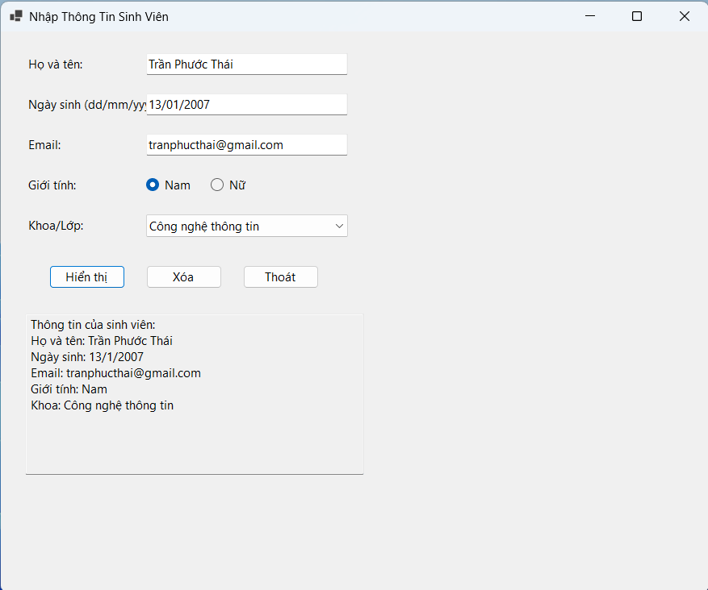
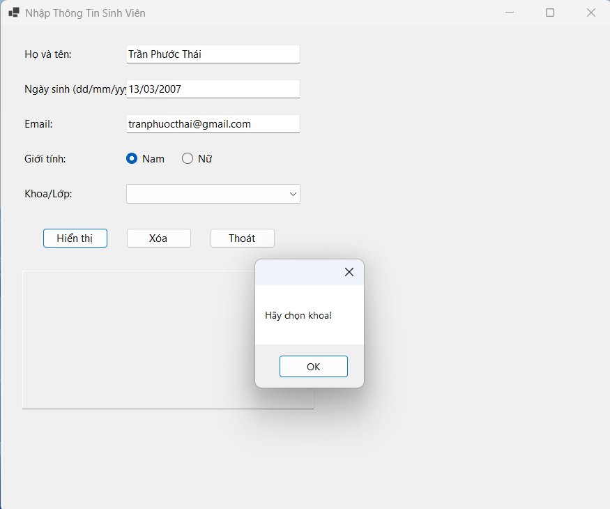
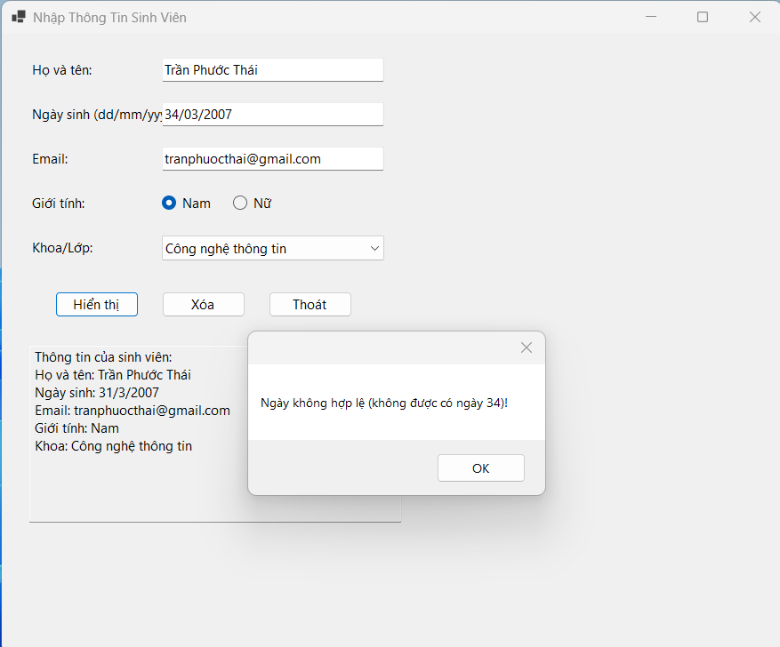
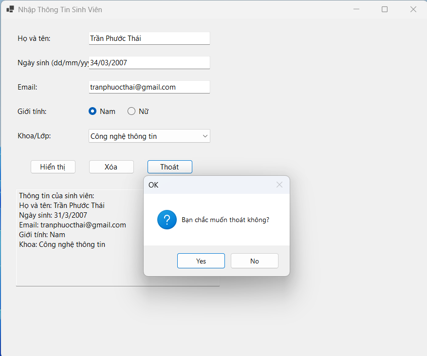

# Lab 01 - Ứng dụng WinFormsnhập thông tin cá nhân

## Thông tin sinh viên
* **Họ tên:** Trần Phước Thái
* **MSSV:** 51.01.104.091
* **Lớp:** 51.01.CNTT.B

## Mô tả
Ứng dụng WinForms để nhập và hiển thị thông tin cá nhân của sinh viên và kiểm tra dữ liệu đầu vào phù hợp.

## Chức năng
* Nhập thông tin: Họ tên, Năm sinh, Email.
* Lựa chọn: Giới tính, Khoa.
* Nút Hiển thị: Kiểm tra dữ liệu hợp lệ và xuất kết quả.
* Nút Xóa: Đặt lại dữ liệu nhập về mặc định.
* Nút Thoát: Xác nhận người dùng trước khi tắt chương trình.

## Hình ảnh minh họa

### 1. Giao diện chương trình

### 1. Hiển thị thông tin thành công

### 2. Kiểm tra dữ liệu: Nhập thiếu thông tin

### 3. Kiểm tra dữ liệu: Nhập sai

### 4. Hộp thoại xác nhận khi thoát
