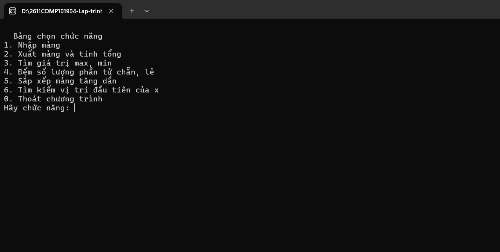
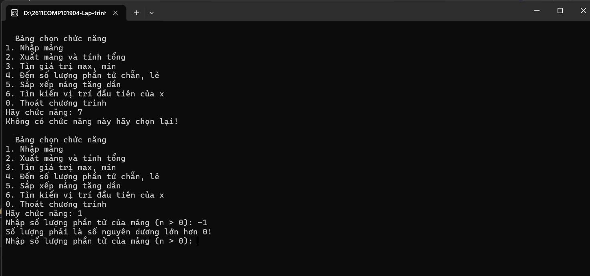
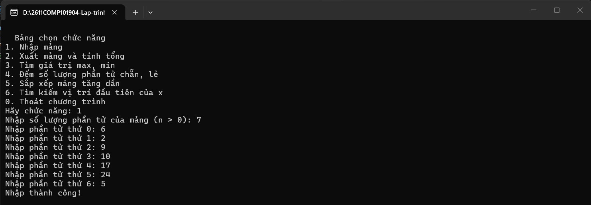
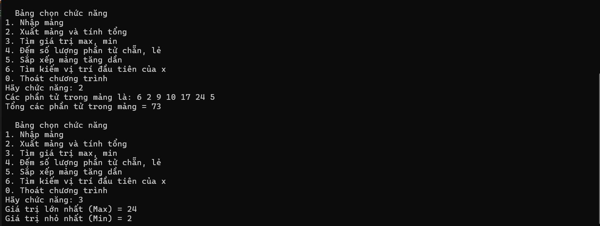
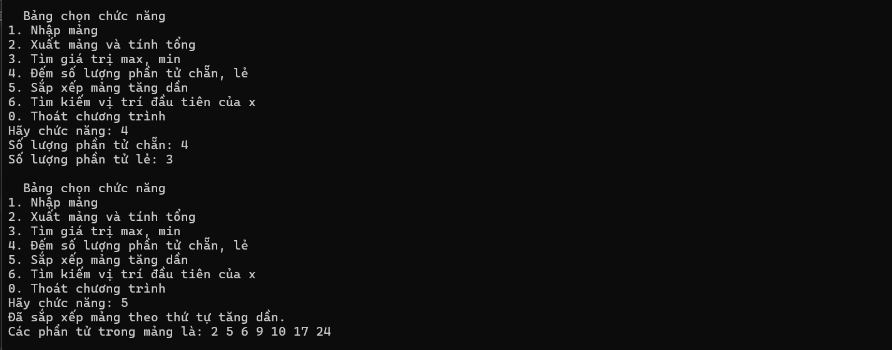
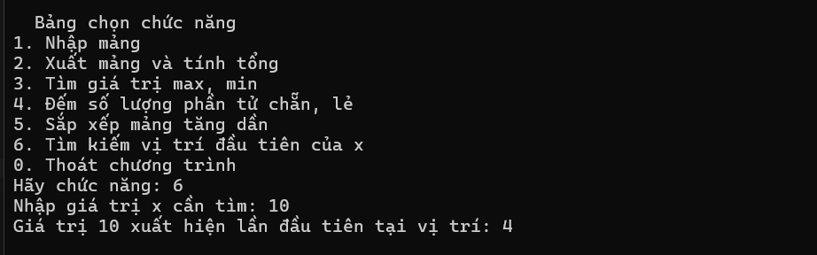

# Lab 01 - ỨNG DỤNG CONSOLE ĐỂ QUẢN LÝ MẢNG SỐ NGUYÊN 

## Thông tin sinh viên
* **Họ tên:** Trần Phước Thái
* **MSSV:** 51.01.104.091
* **Lớp:** 51.01.CNTT.B

## Mô tả
Ứng dụng Console quản lý mảng 1 chiều với các chức năng:
- Nhập mảng.
- Xuất và tính tổng mảng.
- Tìm giá trị lớn nhất và nhỏ nhất.
- Đếm số lượng phần tử chẵn, lẻ.
- Sắp xếp mảng theo thứ tự tăng dần.
- Tìm kiếm vị trí xuất hiện đầu tiên của giá trị x.
- Xử lý khi người dùng chưa nhập mảng, kiểm tra và chống crash khi nhập sai.

## Hình ảnh minh họa

### 1. Giao diện chương trình

### 2. Khi nhập sai

### 3. Nhập mảng

### 4. Tính tổng & Tìm giá trị min, max

### 5. Tính số phần tử chẵn lẻ & Sắp xếp theo thứ tự tăng dần

### 6. Tìm vị trí của phần tử
