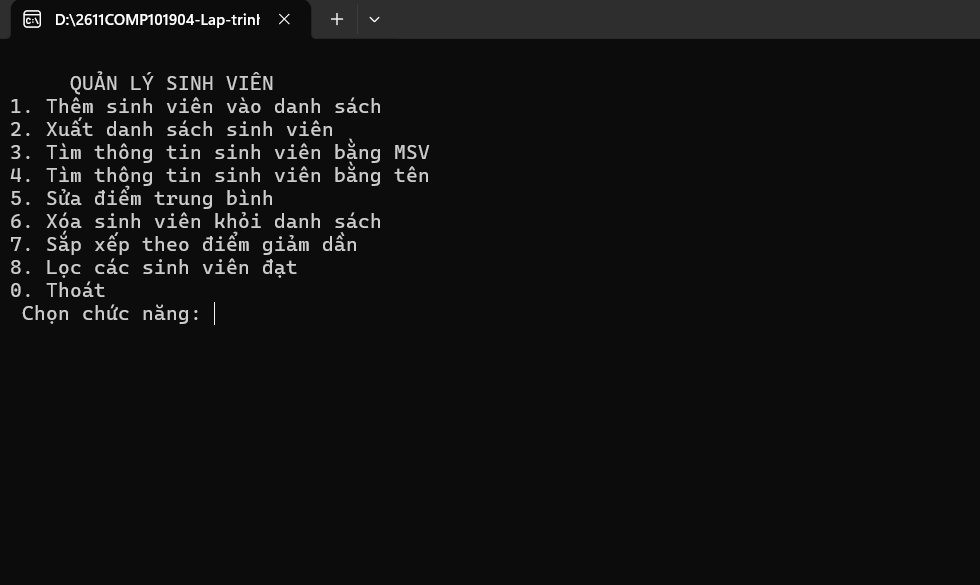
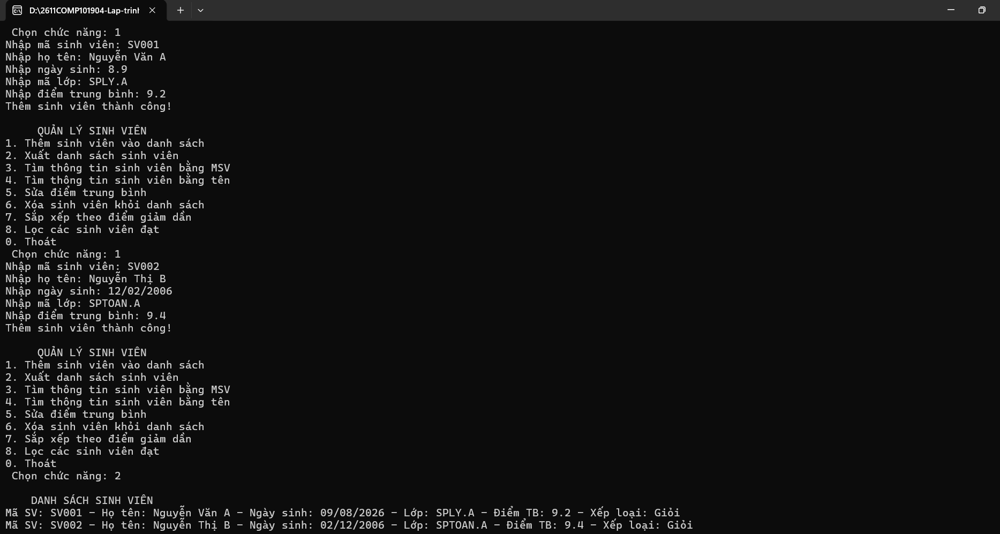
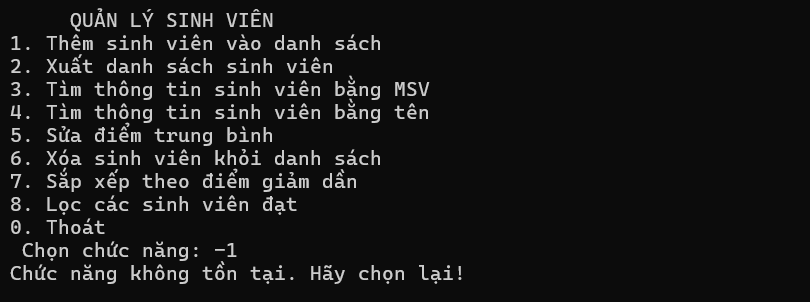
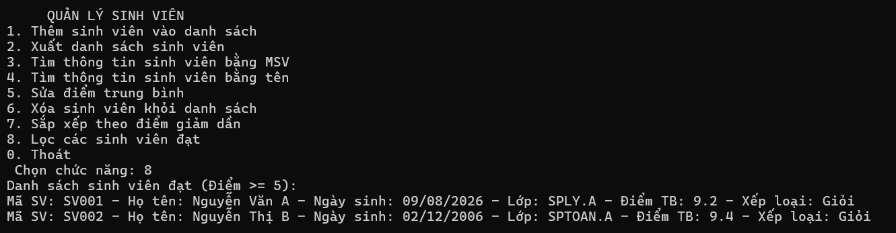
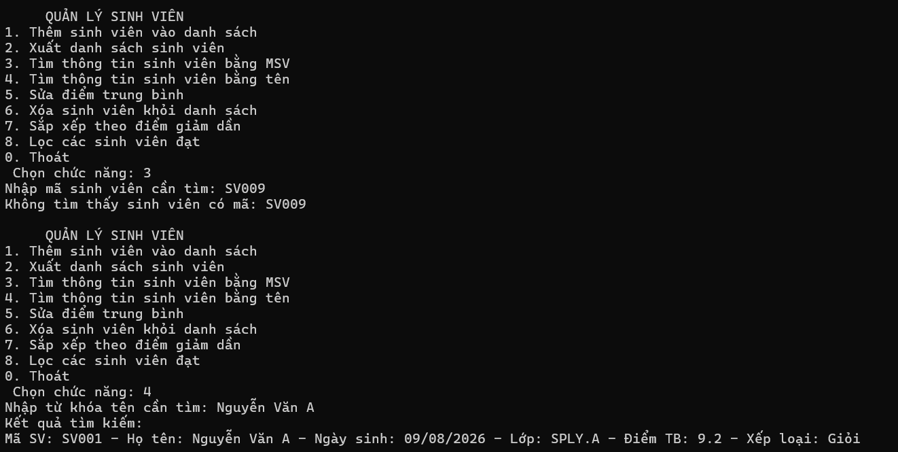
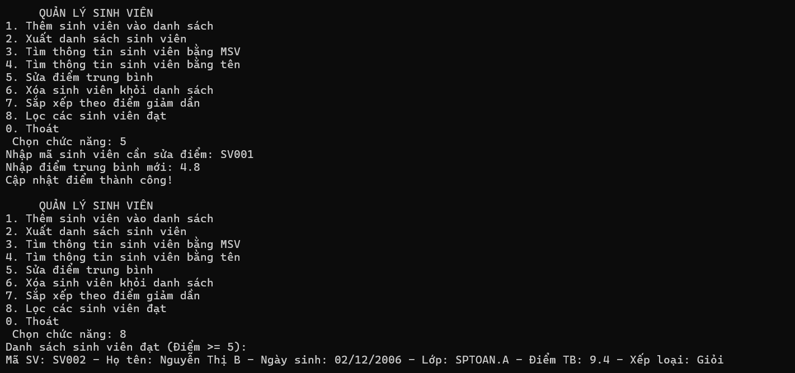
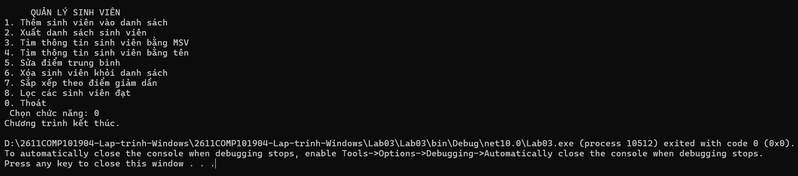

# Lab 03 -Chương trình Console Application phục vụ quản lý sinh viên

## Thông tin sinh viên
* **Họ tên:** Trần Phước Thái
* **MSSV:** 51.01.104.091
* **Lớp:** 51.01.CNTT.B

## Mô tả
Chương trình Console Application phục vụ quản lý sinh viên theo mô hình (OOP). Hệ thống cho phép thực hiện đầy đủ các thao tác CRUD, tra cứu, phân loại và sắp xếp dữ liệu thông qua Menu điều khiển.

## Chức năng
1. **Thêm sinh viên**: Nhập đầy đủ thông tin; tự động kiểm tra trùng mã và kiểm tra khoảng điểm 0 - 10.
2. **Xuất danh sách**: In toàn bộ danh sách sinh viên kèm xếp loại học lực.
3. **Tìm theo mã**: Tìm chính xác mã.
4. **Tìm theo tên**: Tìm theo từ khóa họ tên.
5. **Sửa điểm**: Cập nhật lại điểm trung bình cho sinh viên theo mã chỉ định.
6. **Xóa sinh viên**: Xóa sinh viên khỏi hệ thống dựa vào mã sinh viên.
7. **Sắp xếp theo điểm giảm dần**: Xuất danh sách xếp hạng từ cao xuống thấp bằng LINQ.
8. **Lọc sinh viên đạt**: Lọc và hiển thị các sinh viên có điểm ≥ 5.0 bằng LINQ.
0. **Thoát**: Kết thúc ứng dụng.

## Hình ảnh minh họa

### 1. Giao diện chương trình

### 2. Nhập thông tin thành công

### 3. Chọn chức năng không tồn tại

### 4. Xuất danh sách sinh viên

### 5. Tìm kiếm thông tin của sinh viên 

### 6. Sửa điểm và xuất danh sách sinh viên đạt 

### 7. Thoát chương trình
