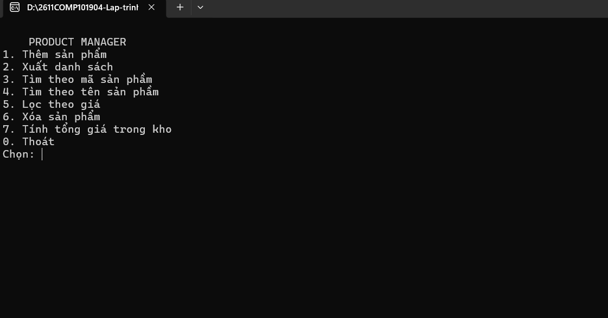
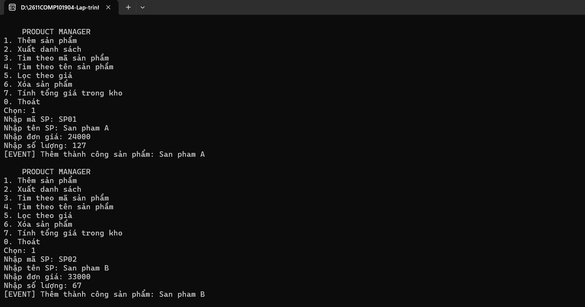
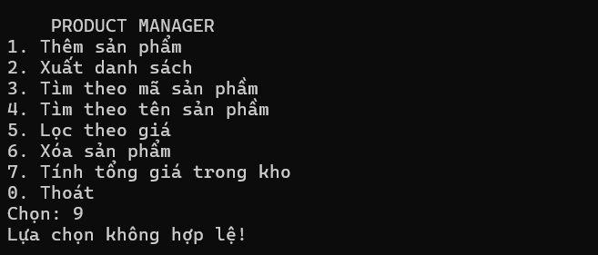
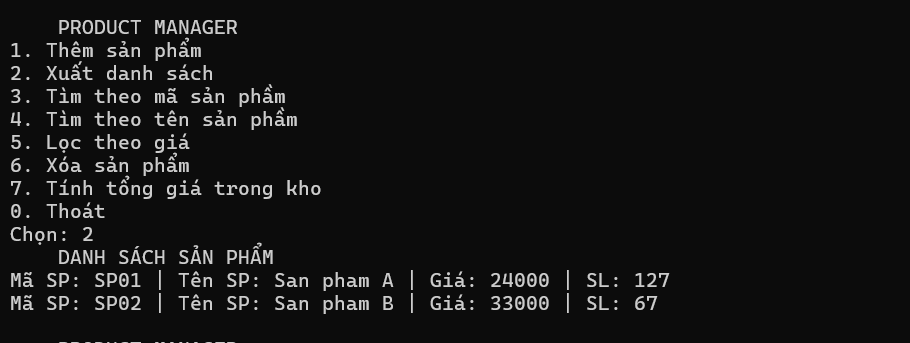
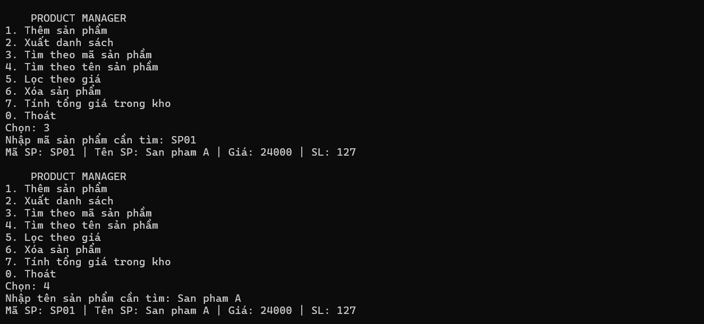
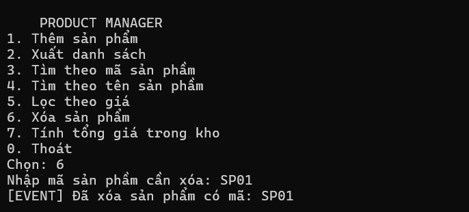
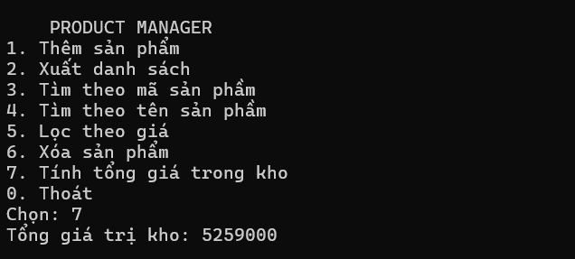
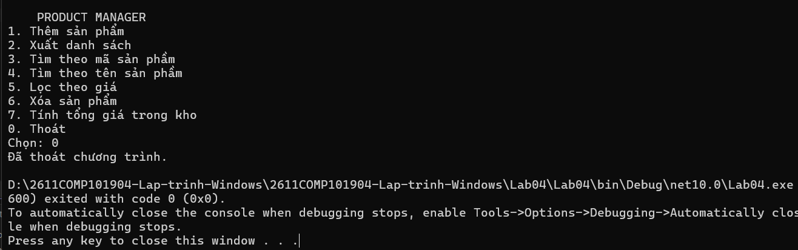

# Lab 03 -Chương trình Console quản lý sản phẩm

## Thông tin sinh viên
* **Họ tên:** Trần Phước Thái
* **MSSV:** 51.01.104.091
* **Lớp:** 51.01.CNTT.B

## Mô tả
Chương trình Console quản lý sản phẩm. Dữ liệu được lưu trong bộ nhớ bằng một Repository<T>. Chương trình phải xử lý lỗi nhập liệu, mã sản phẩm trùng và sản phẩm không tồn tại bằng exception phù hợp.

## Chức năng
1. Thêm sản phẩm
2. Xuất danh sách
3. Tìm theo mã sản phầm
4. Tìm theo tên sản phầm
5. Lọc theo giá
6. Xóa sản phẩm
7. Tính tổng giá trong kho
0. Thoát

## Hình ảnh minh họa

### 1. Giao diện chương trình

### 2. Nhập thông tin thành công

### 3. Chọn chức năng không tồn tại

### 4. Xuất danh sách sản phẩm

### 5. Tìm kiếm thông tin của sản phẩm 

### 6. Xóa sản phẩm

### 6. Tính tổng giá trị kho

### 7. Thoát chương trình
