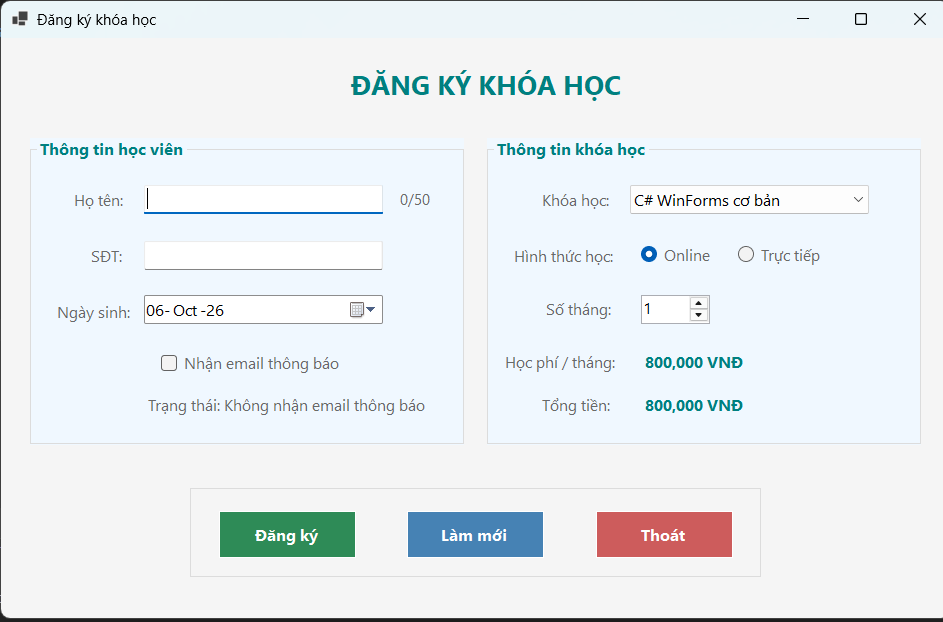
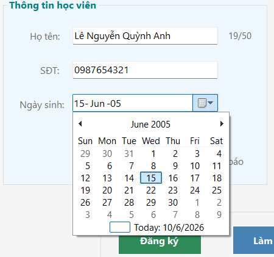
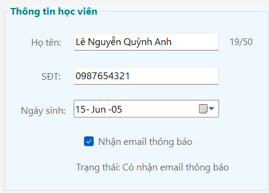
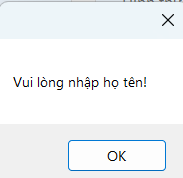
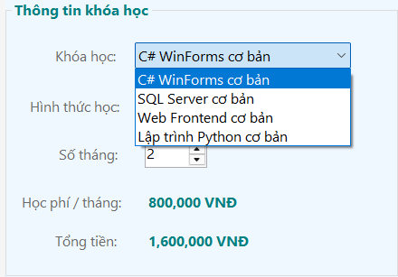
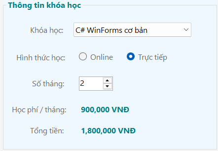
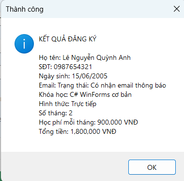
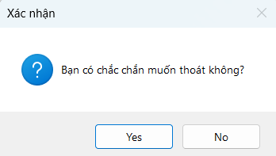

# Lab 05 - Ứng dụng WinForms Đăng ký khóa học

## Thông tin sinh viên
* **Họ tên:** Trần Phước Thái
* **MSSV:** 51.01.104.091
* **Lớp:** 51.01.CNTT.B

## Mô tả
Ứng dụng WinForms tên CourseRegistrationApp dùng để quản lý việc đăng ký khóa học ngắn hạn. Chương trình sử dụng các control cơ bản để thiết kế giao diện, bắt lỗi nhập liệu của người dùng, tự động tính toán học phí dựa trên khóa học và hình thức học, sau đó hiển thị kết quả phiếu đăng ký qua hộp thoại thông báo.

## Chức năng
1. Hiển thị thông tin và thiết lập giá trị mặc định khi tải Form
2. Tự động tính tổng tiền khi thay đổi khóa học, hình thức học (Online/Trực tiếp) hoặc số tháng
3. Kiểm tra tính hợp lệ của dữ liệu đầu vào (họ tên rỗng, số điện thoại phải đủ 10 chữ số)
4. Xử lý đăng ký và xuất thông tin chi tiết qua MessageBox
5. Làm mới toàn bộ dữ liệu trên giao diện về trạng thái ban đầu
6. Thoát chương trình với hộp thoại xác nhận an toàn

## Hình ảnh minh họa

### 1. Giao diện chính của chương trình

### 2. Cảnh báo lỗi khi nhập sai số điện thoại hoặc thiếu họ tên

### 3. Tự động tính toán tổng tiền khi thay đổi lựa chọn

### 4. Thông báo đăng ký thành công

### 5. Hộp thoại xác nhận trước khi thoát
